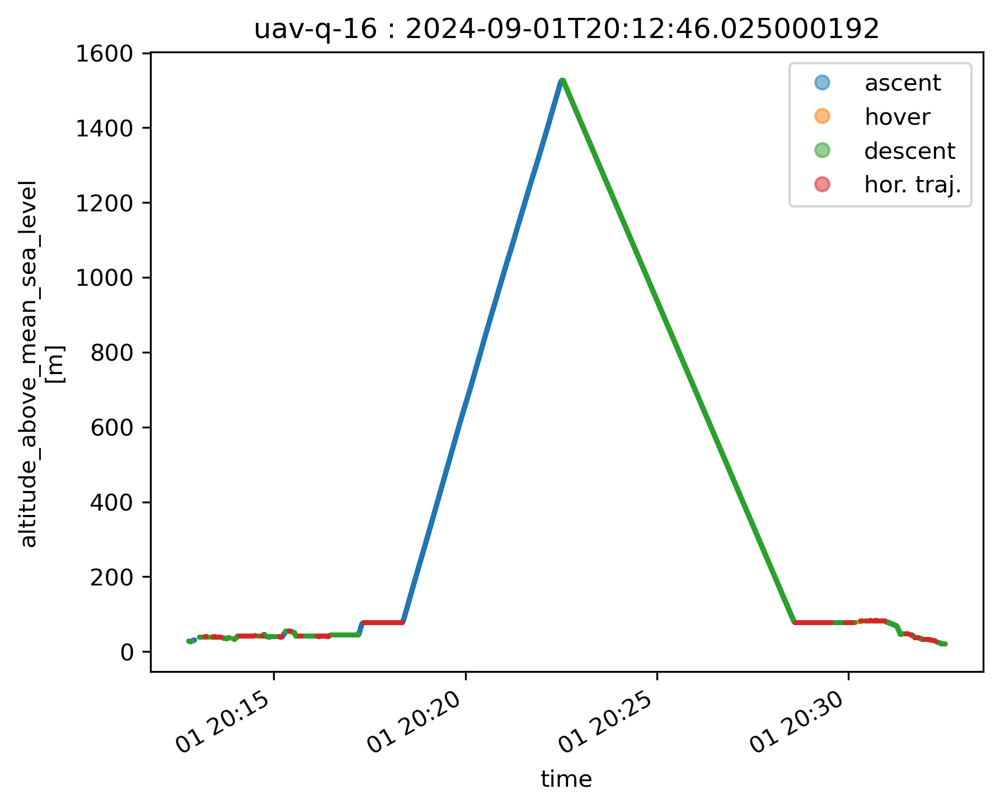
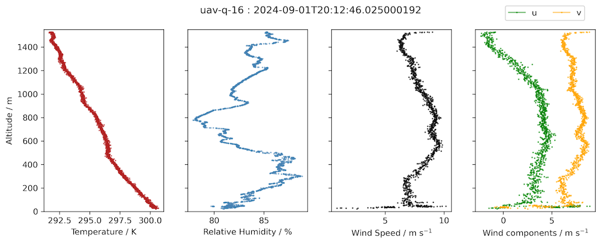
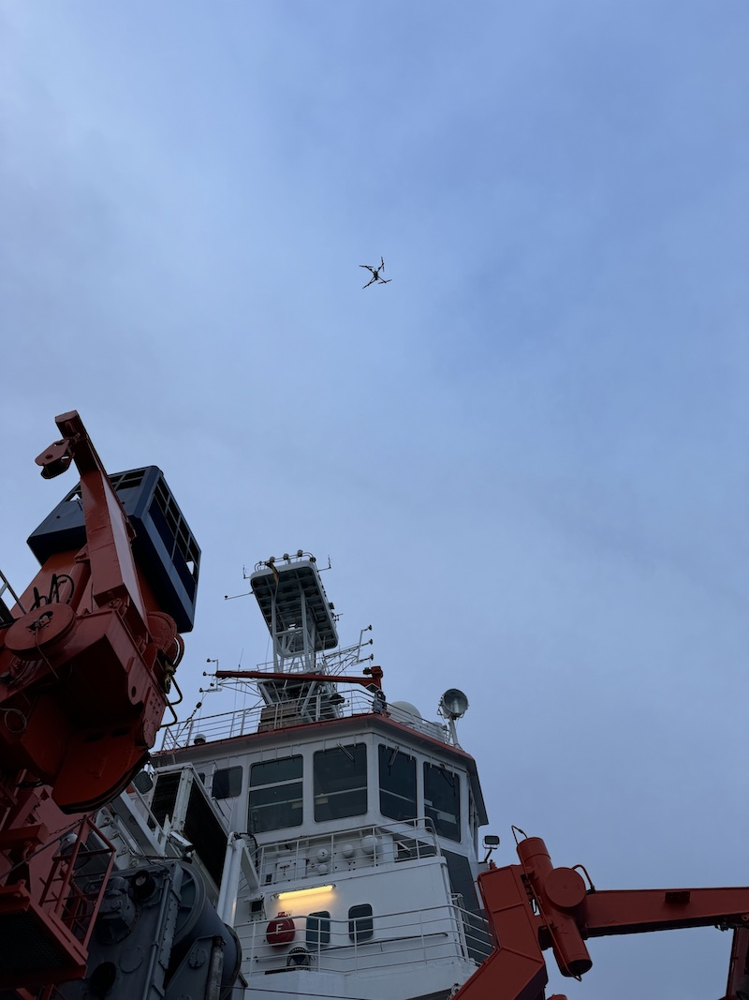

{logo}`BOWTIE`

# {front}`report_id`

## Summary

RV Meteor is heading SSE towards a drift buoy we deployed a few days ago (you can track it [here](https://data.geomar.de/realtime/data/project/300434067159110/img/300434067159110_pos_105.png)). The buoy continues to drift even further; we now estimate we'll have to go as far East as 35.5W to recover it. This puts even more pressure on our dwindling time, and we will consequently conduct stations (when ship is stopped for measurements) less frequently throughout the remainder of the cruise. 

Sadly, this morning STRINQS suffered another failed flight, in which a drone again decided that it would rather join the gliders and drifters in taking oceanic measurements, rather than atmospheric ones. Just after take-off, the drone slowly descended with high pitch and roll changes before landing gently in the water, about 15-20 m away from the ship. There was a GNSS error a fraction of a second before take-off and a few seconds later communication with the remote controller was lost, leaving the pilot unable to control the drone. The floatation device deployed as expected and this time we were able to retrieve the drone with its attached battery and return it to Meteor. Since the battery was smoking, safety precautions were undertaken before removing it, hosing down and disassembling the drone. While the drone's electronics looked relatively okay, there were clear burn signs on the bottom of the drone where it connects to the battery. In the coming days and weeks, the STRINQS team and the drone manufactioner will study the logs from the retrieved drone, the recording of the incoming operations telemetry, and video footage from the attached GoPro camera to understand what went wrong. However, due to the dwindling supply of functional drones and batteries and the risks of attempting additional flights, STRINQS has made the difficult decision to cease operations until further notice.

In their quest to collect detailed measurements of the atmospheric (and apparently also oceanic) boundary layer, STRINQS conducted 18 missions with more than 40 flights over the course of their 12 days of operations on board Meteor. They successfully flew two or three drones together in formation and achieved profiles of up to 1.5 km altitude. An example of one of these profiles from 01.09 is shown below, figures courtesy Geet George. The measurements indicate a lapse rate a bit above 5 K/km in the lowest km of the atmosphere and relative humidity between 80-85%. The STRINQS team will make the most of their available data, while also taking the opportunity to reassess and learn from this experience, in which they were the first to attempt flying these drones from a ship. The photo below shows the drone coming in to land on its last successful flight yesterday evening. 

In terms of the weather, we continue to be east of Invest 92L, a tropical disturbance that has a 60% chance of developing into a tropical cyclone. We had partly cloud skies for most of the day before another intense gust front ahead of an outward propagating rainband from Invest 92L to our west brought us rain this evening. Another trough of low pressure to our east is expected to merge in a few days with a potent tropical wave near the coast of Africa. This sytem is likely (70% chance) to form a tropical depression within the next 7 days. While the models currently have it developing north of our position, there is substantial uncertainty and we will need to continue to keep an eye on the forecast. The development, or lack thereof, of these systems also influences the expected structure of the ITCZ, and thus the position of our next transect.

## Remarks
- Meteor is in the UTC-2 time zone.
- Radiosondes were launched on the normal 3-hourly schedule.
- STRINQS has ceased operations. 

## Plans
- 09.09 - 12.09: Return to 8N between 35.5W and 38W to recover the deployed oceanographic instruments. 
- 12.09 - 16.09: Head west towards 10N, 47W

## Events

Time (Local) | Comment
------------- | -----
00:09 - 01:26 | Incubation CTD
01:35 - 01:55 | SEA-POL circle
02:18 - 02:38 | Incubation CTD
08:57 - 09:22 | MSS
09:30 - 10:46 | CTD
09:31 - 09:35 | Drones
20:58 - 21:27 | MSS
21:33 - 22:00 | CTD
22:20 - 22:40 | SEA-POL circle

