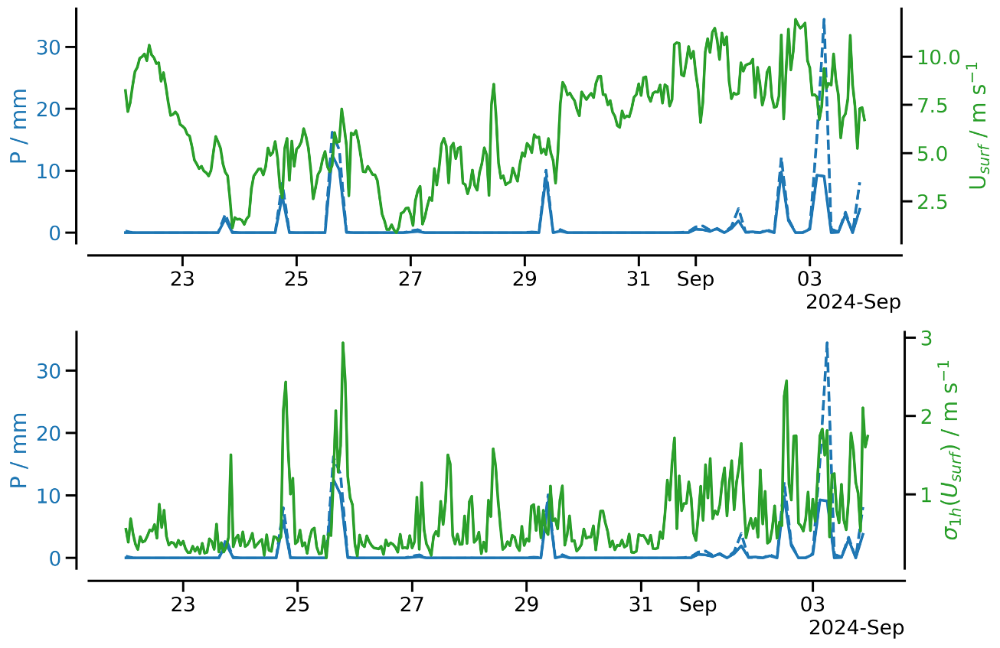

{logo}`BOWTIE`

# {front}`report_id`

## Summary

RV Meteor began the day with an early morning MSS and CTD station, plus some fishing near the Pirata mooring. We then collected our last glider this morning from 7.95N, 37.87W. We are now leaving the central Atlantic and are heading west towards 10N, 47W! Once we get there in a few days, we will deploy our autonomous oceanographic instruments for a third and final time. As our time on the Meteor continues to dwindle, this will be a shorter deployment (around 3 days) before we must head to Barbados.

After two days of nearly continuous rain, today we found ourselves in mostly sunny conditions throughout most of the day, due to our westerly track and the northwestward movement of TD 7. We were within radar range of a line of convection trailing to the southwest of TD7, but unfortunately the SEA-POL radar was down for much of the day due to a loss of power in the radar container. Several other instruments have also struggled with the amount of water falling from the sky; see remarks below. 

We also had our usual daily briefing and science discussion at 10:20 LT, in which Hans Segura presented about wind-precipitation feedbacks and the light wind regime in ICON simulations and BOWTIE observations. Hans noted that ICON simulations have a low bias in precipitation over the tropical western Pacific warm pool, which has been linked to a high frequency of low surface winds simulated by the model in that region. By increasing the minimum wind speed in the surface flux calculation, they are able to increase surface enthalpy fluxes and thus precipitation. This behavior is speculated to be an artifact of unresolved convective gustiness, but also reflects a real physical coupling between winds, surface enthalpy fluxes, and precipitation. Given the model results, Hans searched for evidence of this coupling in the BOWTIE data. He noted an event on August 26, in which light winds with little variability coincided with a lack of precipitation, a probable oceanic diurnal warm layer, and a distinct wind and BL stability profile compared to rainy days (see figure below, courtesy Hans Segura). 

## Remarks
- Meteor is in the UTC-2 time zone.
- Radiosondes were launched on the normal 3-hourly schedule.
- STRINQS has ceased drone operations. 
- The gas exchange measurements have ceased.
- The WindCube lidar stabilization is not working, but the lidar is still running. 
- The SEA-POL radar container lost power early this morning due to a water-logged power cable. The radar was down for about 11 hours (06:10 - 15:00 UTC) while repairs were made. 

## Plans
- 12.09 - 15.09: Head west towards 10N, 47W
- 15.09: Deploy oceanographic instruments at 10N, 47W
- 15.09 - 18.09: Partial ITCZ transect (details TBD)
- 18.09: Retrieve oceanographic instruments at 10N, 47W
- 18.09 - 23.09: Head northwest toward Barbados
- 23.09: Station off of Barbados Cloud Observatory
- 24.09: Arrive in port at Bridgetown, Barbados

## Events

Time (Local) | Comment
------------- | -----
01:00 - 01:45 | MSS
01:56 - 03:12 | CTD
03:30 - 03:50 | SEA-POL circle
08:39 - 08:55 | Retrieved glider
10:20 | Meeting led by D. Klocke, science presentation by H. Segura
20:01 - 20:31 | MSS
20:38 - 21:55 | CTD

