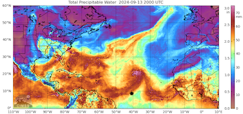
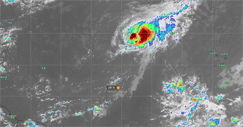
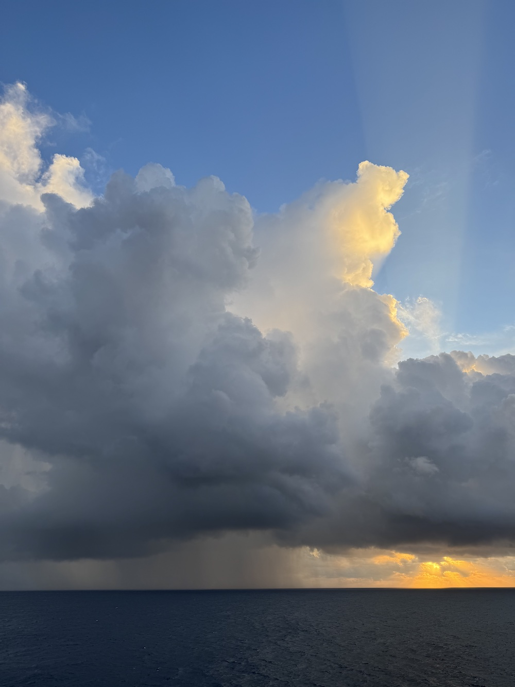

{logo}`BOWTIE`

# {front}`report_id`

## Summary

RV Meteor continued to head west/northwest towards 10N, 47W. In order to make up time, we are now conducting oceanographic stations approximately every 12 hours, instead of every 6 hours. This is allowing us to travel more quickly but also has reduced the bustle of activity on board. 

Today we again had good sunbathing weather, before scattered showers popped up in the late afternoon and early evening. The structure of the ITCZ is currently strongly influenced by now Tropical Storm Gordon. As seen in the CIMSS MIMIC-TPW image below (approximate position of Meteor indicated with the symbol), the ITCZ is curling up as its moisture is being drawn into Tropical Storm Gordon, which was located at 19.5N, 39.5W as of 1900 UTC. We have remained right near the edge of the moist region that is trailing to the southwest of Gordon, and expect to stay in this location relative to the moisture gradient as both Meteor and Gordon are traveling west/northwest at 10 knots. It will be interesting to see whether we will fall behind into the dry region when we stop for stations or stop to deploy oceanographic instruments (planned for Sunday), but Gordon's forward movement is also expected to slow down. It also remains to be seen whether Gordon will be able to maintain its intensity, nevermind strengthen, as it moves into a drier airmass.

Outside of Gordon, the western and central Atlantic are largely devoid of convection (see infrared GOES satellite image below, from windy.com). Despite the largely suppressed conditions, congestus and scattered pop-up convection have developed along that steep gradient in moisture in the afternoon/evening both yesterday and today. We experienced some rain this evening associated with small convective cells with tops near 4-6 km, which were not especially impressive on radar but made for some beautiful imagery at sunset.

We also had our usual daily briefing and science discussion at 10:20 LT, in which Geet George presented "The Story of STRINQS". He shared the motivation for the drone campaign, which stemmed from his work studying the doldrums using satellite imagery. As viewed from space, precipitation nearly never occurs in the doldrums, but we have experienced weak, shallow precipitating convection while in the doldrums during the BOWTIE cruise. STRINQS was designed to take observations of the atmospheric boundary layer, sampling both horizontal and vertical gradients at scales of 1.5 km in the vertical and 2-5 km in the horizontal. STRINQS suffered many challenges throughout the campaign, from the delayed air freight which prohibited them from joining the cruise until 12 days in to difficulties with the batteries, which arrived completely drained of charged after their long transport, and ultimately the end of operations after two drones fell into the sea. Despite these challenges, STRINQS managed to collect more than 35 vertical profiles and conducted more than 6 hexagon sampling patterns around the ship. Some of the initial looks at the data are intriguing, such as vertical profiles collected just ahead of and behind the passage of a squall line on 08.09. While ultimately STRINQS may not have enough samples to comprehensively compare the boundary layer structure in different ITCZ regimes, the preliminary data and the fact that the drones were able to fly in rainstorms with 30 kt winds gives much hope for similar measurements on future campaigns, provided that improvements are made to make the drones and the battery performance more reliable. 

## Remarks
- Meteor is in the UTC-2 time zone. We will change to UTC-3 tomorrow (Saturday) night.
- Radiosondes were launched on the normal 3-hourly schedule.
- STRINQS has ceased drone operations. 
- The gas exchange measurements are no longer running.
- The WindCube lidar stabilization is not working, but the lidar is still running. They have adjusted the scan strategy to minimize the need for stabilization. INU data is being stored so the retrievals can be corrected for ship motion in the post-processing.

## Plans
- 13.09 - 15.09: Head west towards 10N, 47W
- 15.09: Deploy oceanographic instruments at 10N, 47W
- 15.09 - 18.09: Partial ITCZ transect (details TBD)
- 18.09: Retrieve oceanographic instruments at 10N, 47W
- 18.09 - 23.09: Head northwest toward Barbados
- 23.09: Station off of Barbados Cloud Observatory
- 24.09: Arrive in port at Bridgetown, Barbados

## Events

Time (Local) | Comment
------------- | -----
08:30 - 09:02 | MSS
09:08 - 10:13 | Plankton CTD
10:20 | Meeting led by D. Klocke, science presentation by G. George
15:30, 16:16 | Tours of Meteor engine room
21:00 - 21:30 | MSS
21:37 - 22:54 | CTD
23:00 - 23:15 | SEA-POL turn 

