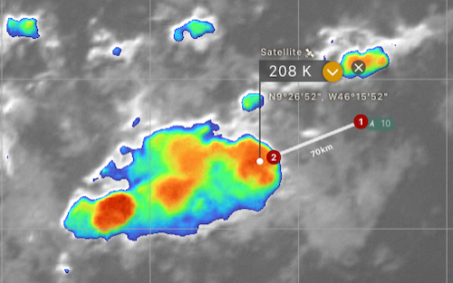
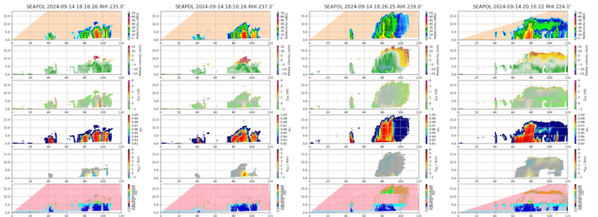
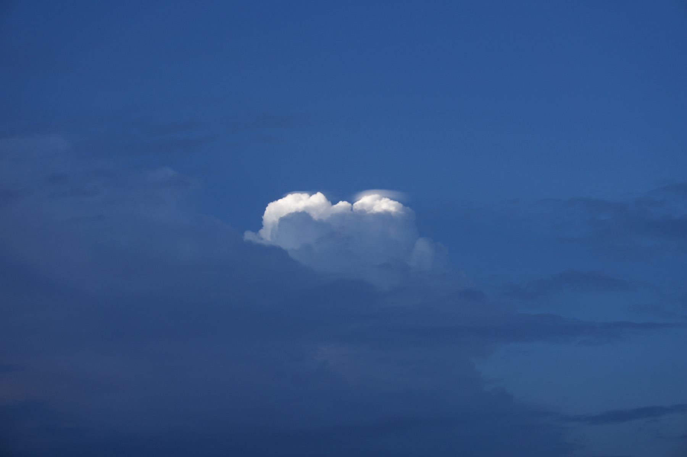

{logo}`BOWTIE`

# {front}`report_id`

## Summary

RV Meteor continued to head west/northwest towards 10N, 47W. It was a hot day, with maximum air temperatures of 29.5C and maximum ocean temperatures of 30.3C. While we had sunny skies much of the day over the Meteor, the atmosphere put on a show around us. In the evening, SEA-POL sampled the life cycle of a long-lived deep convective cell to our southwest, from its initial explosive growth to its mature phase with extensive stratiform anvil. This was some of the deepest convection that we have sampled, with echo top heights up to 18 km and cloud top temperatures less than 210 K, according to infrared satellite imagery (see plot from windy.com below). 

This will have to be confirmed in the actual statistics once the SEA-POL data is post-processed, but our perception has been that truly deep convection is quite rare. Thus, it was a treat to sample this convective cell for several hours and make the most of SEA-POL's advanced dual-polarimetric capabilities. There are several notable features in the below sequence of scans. In the left panel, the Zdr "worm", a column of high values of differential reflectivity (third panel from top), indicates large drops in the rain shaft. In the panel that is second from left, which is from the same time at a slightly different location with the storm, the bullseye of high Kdp values (specific differential phase, in the second panel from bottom) combined with relatively low values of Zdr suggest very high rain rates with many small droplets. Ten minutes later (second panel from right), the storm had deepened with echo tops of 18 km. About two hours later (right panel), the storm still persisted but the deep convective core with heavy rain was feeding an expanding stratiform anvil and the storm exhibited a widespread region of light to moderate rain.

We also observed another fascinating atmospheric phenomenon: pileus clouds! As seen in the photo below, courtesy Dominik Austen, a pileus is a small cloud that forms on top of a cumulus cloud and has a smooth, horizontal cap shape. They typically are short-lived but can indicate that the cumulus cloud is deepening. 

Finally, we had our usual daily briefing and science discussion at 10:20 LT, where Delian Colon-Burgos gave a presentation about convective organization within African Easterly Waves. She provided a review of African Easterly Waves (AEWs), which are elongated areas of low pressure that originate from the African continent and move along the trade wind easterlies. AEWs form from a combined barotropic/baroclinic instability of the African Easterly Jet and show a distinctive inverted V pattern in their convection, with a kink in the wind field and pressure contours. They are associated with widespread showers and thunderstorms and, as we've seen during the cruise, play a huge role in determining the structure of the ITCZ at any given time. Delian described some of her research on the dynamical processes that govern the location, organization, and intensity of deep convection in weakly rotating flows. She is examining the structure of potential vorticity, moisture, and wind shear in 20 cases of AEWs from past field campaigns, and is classifying patterns of shallow, moderate, and deep convection from satellite imagery. As we have learned during our cruise, the view of cold cloud shields from space does not always match the structure of precipitation underneath it, so Delian hopes to use SEA-POL data to characterize the precipitation associated with AEWs during the BOWTIE cruise as part of her future research.  

## Remarks
- Meteor is changing time zones from UTC-2 to UTC-3 tonight at 3 AM LT.
- Radiosondes were launched on the normal 3-hourly schedule.
- STRINQS has ceased drone operations. 
- The gas exchange measurements are no longer running.
- The WindCube lidar stabilization is not working, but the lidar is still running. 
- We plan to meet HALO within their "c_mid" circle on 16.09 and catch the EarthCare overpass.

## Plans
- 15.09: Deploy oceanographic instruments at 10N, 47W
- 15.09 - 18.09: Partial ITCZ transect to the south. Meet HALO and EC on 16.09.
- 18.09: Retrieve oceanographic instruments at 10N, 47W
- 18.09 - 23.09: Head northwest toward Barbados
- 23.09: Station off of Barbados Cloud Observatory
- 24.09: Arrive in port at Bridgetown, Barbados

## Events

Time (Local) | Comment
------------- | -----
08:58 - 09:28 | MSS
09:34 - 10:52 | CTD
10:20 | Meeting led by D. Klocke, science presentation by D. Colon-Burgos
10:55 - 11:13 | SEA-POL turn

