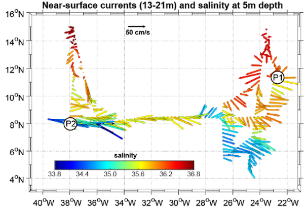
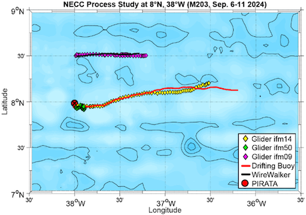
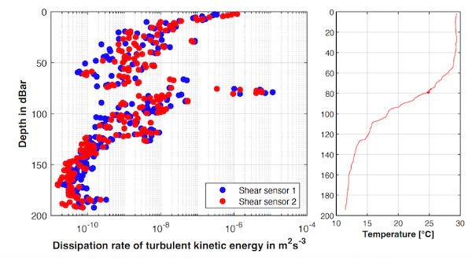

{logo}`BOWTIE`

# {front}`report_id`

## Summary

RV Meteor reached its deployment location (10N, 47W) this morning, after a night of active convection. Torrential rain in the middle of the night disrupted the 6 UTC radiosonde launch, in which a series of three attempts failed. The first sonde, launched in drizzle, exhibited a humidity sensor error. A new sonde was quickly prepared, but by this time very heavy rain had begun, and the sonde lost connection soon after launch. A third attempt was made about an hour later, after the rain had died down, but it also seems to have lost connection around 500 hPa. While the sondes were not happy about the rain, the SEA-POL radar recorded reflectivities of 61.4 dBZ, which is the heaviest rain we've seen near the Meteor to date. 

After the rain cleared, sunny skies prevailed for a busy morning and early afternoon of oceanographic instrument deployments. We first deployed a drift buoy and glider this morning and then headed about 15 nm south to deploy the second glider and the WireWalker. This is our third deployment of these instruments and it will be the shortest deployment, only three days, due to our time constraints. In their first deployment, the gliders and drift buoys measured strong inertial oscillations in the eastern Atlantic. In their second deployment in the central Atlantic, the drift buoy got caught in the North Equatorial Countercurrent (NECC) and headed straight to the east. The near-surface currents measured by the Acoustic Doppler Current Profiler (ADCP) on the RV Meteor during our cruise thus far are shown in the first figure below, courtesy Marcus Dengler. The current was so strong that the glider meant to follow the drift buoy had a hard time keeping up! A different glider that was meant to circle the Pirata buoy at 8N, 38 W also had a hard time staying in place (see second figure below, courtesy Marcus Dengler). 

In the central Atlantic, both our MSS stations and the gliders measured surprisingly strong mixing between 60 to 100 m depth which is hypothesized to be due to shear turbulence in the NECC. An example from one of the more than 1000 profiles taken by the gliders is shown in the figure below, courtesy Marcus Dengler. There is high turbulence around 75-80 m depth (left panel) which is also reflected in the high temperature variance measured by the fast-responding temperature sensor mounted to the turbulence proble (right panel). This suggests large Kelvin-Helmholz type overturning in that depth range. The strong mixing in mixed layer near the surface is also apparent. In other profiles, the mixing is spread over a wider range of depths, but this particular profile has especially high turbulent mixing rates! Additional analysis of the glider data will be performed after the campaign, but these initial observations are consistent with MSS profiles taken by Meteor during our stations in the central Atlantic, performed approximately every 60 nmi. 

## Remarks
- Meteor changed time zones and is now in UTC-3.
- Radiosondes were launched on the normal 3-hourly schedule. The 6 UTC sonde was late due to failed launches in a rainstorm.
- STRINQS has ceased drone operations. 
- The gas exchange measurements are no longer running.
- The WindCube lidar stabilization is not working, but the lidar is still running. 
- We plan to meet HALO along the EarthCare orbit near the southern edge of HALO's first circle tomorrow (16.09). A coordinated meeting is also planned for 19.09.

## Plans
- 16.09 - 18.09: Partial ITCZ transect to the south. Meet HALO and EC on 16.09, near the southern edge of HALO's first circle.
- 18.09: Retrieve oceanographic instruments at 10N, 47W
- 18.09 - 23.09: Head northwest toward Barbados. Meet HALO on 19.09 near 10.65N, 49.5W.
- 23.09: Station off of Barbados Cloud Observatory
- 24.09: Arrive in port at Bridgetown, Barbados

## Events

Time (Local) | Comment
------------- | -----
23:30 - 00:58 | Plankton CTD
01:07 - 01:45 | MSS
02:02 - 02:11 | Incubation CTD
02:15 - 02:25 | SEA-POL spin
06:02 - 06:28 | MSS
06:37 - 07:57 | CTD
08:05 - 08:25 | SEA-POL spin
08:35 - 08:52 | Deploy drift buoy
09:09 - 09:22 | Deploy glider
11:56 - 12:13 | Deploy glider
12:48 - 13:16 | Deploy drift buoy with WireWalker
21:00 - 21:33 | MSS
21:39 - 22:58 | CTD
23:05 - 23:23 | SEA-POL spin

