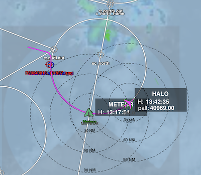
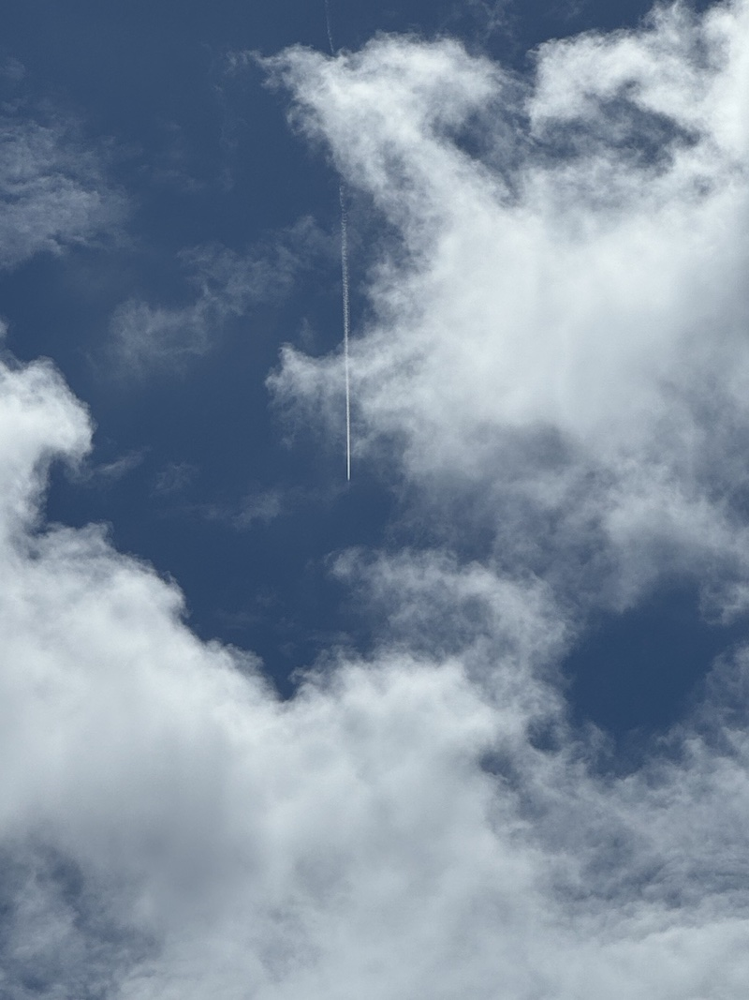
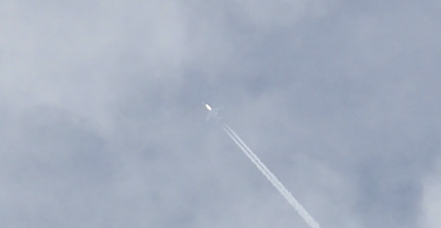

{logo}`BOWTIE`

# {front}`report_id`

## Summary

Today while heading south along our ITCZ transect, RV Meteor met up with HALO and EarthCare for the 7th and 6th time of our cruise, respectively. Like many of our overpasses, there was little precipitation to speak of in the vicinity. On the other hand, the mostly clear skies meant it was a good day for comparing lidar measurements! We positioned ourselves at 7.5155N, 47.6838W, the southern edge of HALO's first circle where it intersected with the EarthCare orbit. SEA-POL conducted a long-range volume scan to cover most of the HALO's circle while we stationed ourselves at that location (see figure below), as well as RHI scans along HALO's trajectory when they flew over us 15 minutes into the circle....but this was an exercise in scanning primarily clear air. After HALO concluded their circle and went onto to other parts of their flight, Meteor headed south along the EarthCare orbit. We met EarthCare at 14:15 LT at 7.118N, 47.760W, under a layer of thin cirrus. About 10 minutes later, at 14:26 LT, HALO flew overhead for a second time. While nothing was visible to SEA-POL, HALO and its contrail were visible to the naked eye from Meteor during both of their overpasses (see photos below). HALO also attempted to drop two dropsonde on Meteor; the first one missed by 12.67 nmi and the second by 4.62 nmi, though they had little chance to hit on us on the second drop due to their track along EarthCare's orbit and the westward drift of the sondes as they fall. Thus the record remains 2.32 nmi, from the flight on 27 August, as the dropsonde to splash down closest to Meteor.

Tonight we reached the southernmost point of our transect around 6N and after conducting a station with an incubation CTD, we turned back north towards 10N, 47W where we will retrieve the gliders and drift buoys that we deployed. After about 32 hours, the drift buoy had [displaced](https://data.geomar.de/realtime/data/project/300434067159110/img/300434067159110_pos_105.png) 17 nmi to the East from where we deployed it. Given that we won't recover it until the morning of 18.09, we expect that we will have to go to at least 46.5 W to pick it up. After we retrieve the drift buoy, two gliders, and the WireWalker, we will head straight towards our final destination - Barbados.

We also held our usual daily briefing at 10:20 LT, where Hans Segura led the weather discussion.

## Remarks
- Meteor changed time zones and is now in UTC-3.
- Radiosondes were launched on the normal 3-hourly schedule.
- STRINQS has ceased drone operations. 
- The gas exchange measurements are no longer running.
- The WindCube lidar stabilization is not working, but the lidar is still running. 
- We plan to meet HALO on 19.09.

## Plans
- 17.09 - 18.09: Return to 10N, 47W to retrieve oceanographic instruments.
- 18.09 - 23.09: Head northwest toward Barbados. Meet HALO on 19.09 near 10.65N, 49.5W.
- 23.09: Station off of Barbados Cloud Observatory
- 24.09: Arrive in port at Bridgetown, Barbados

## Events

Time (Local) | Comment
------------- | -----
07:16 - 07:47 | MSS
07:59 - 09:15 | CTD
09:45 - 10:05 | SEA-POL circle
10:20         | Meeting led by H. Segura
10:18 - 11:22 | HALO circle, coordinated SEA-POL scans
10:30         | HALO overpass, coordinated SEA-POL scans
14:15         | EarthCare overpass, coordinated SEA-POL scans
14:26         | HALO overpass, coordinated SEA-POL scans
15:32 - 16:05 | MSS
16:09 - 17:40 | Plankton CTD
21:30 - 22:00 | MSS
22:00 - 23:30 | Incubation CTD
23:50 - 00:15 | Incubation CTD

