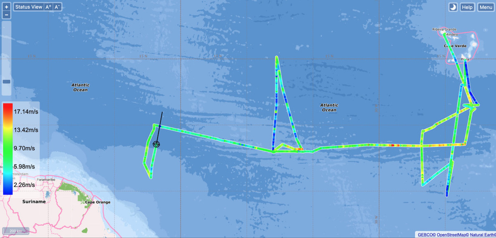
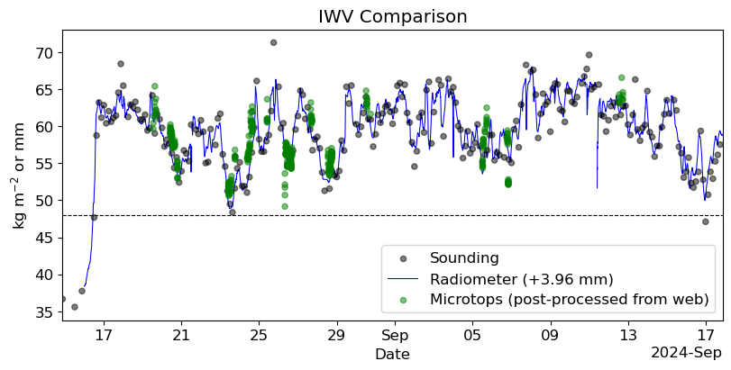

{logo}`BOWTIE`

# {front}`report_id`

## Summary

RV Meteor is heading north, towards 10N, 47 W where we plan to retrieve our gliders and drift buoys tomorrow. This will conclude our western transect of the ITCZ, after which we will head northwest straight to Barbados. It is hard to imagine that this time next week, we will be in port in Bridgetown (perhaps swimming in the ocean, instead of only gazing at it). We have begun making preparations for our departure from the ship, by preparing packing lists and shipping invoices, planning logistics of how to uninstall and pack all our instruments, and receiving instructions on how to clean our lab spaces in order to leave them in good condition for the next group of scientists to come on board. 

Throughout the BOWTIE cruise, we have performed transects of the ITCZ, from northern to southern edge (see plot below, where the color shading of the track indicates the wind speed). We passed into the ITCZ over its northern edge soon after departing Mindelo, more than a month ago. We spent a bit over two weeks in the eastern Atlantic, reaching our southernmost point at 4.65N, 24.88W on August 23. On that day, the microwave radiometer indiated that we spent several hours with a precipitable water value below 48 mm, our metric for the edge of the ITCZ. However, none of the radiosondes launched that day quite went below that threshold (though one measured 48.3 mm, which is very close!) Taken over the whole campaign, we have discovered that the radiometer retrievals of precipitable water are consistently about 4 mm below that from the radiosondes (see second plot below, where the radiometer data has been smoothed with a 2-hour running mean and offset by 3.96 mm, courtesy James Ruppert). When we traveled north to Praia on August 28, we were close to the northern edge of the ITCZ but did not cross it. While in the central Atlantic, we headed north from 8N for our transect. As we traveled north, the edge was perturbed by a tropical disturbance and it continued to drift north as we chased it. Eventually we had to turn around due to time constraints at 15.17N, 37.75 W on September 8, after spending the better part of the day moving north together with the edge.

That brings us to our western transect of the ITCZ. After deploying instruments from 10N on September 15, we headed south. Our measurements of precipitable water steadily fell, and last night we recorded values below 48 mm from both the raw microwave radiometer and radiosonde data. The 00 UTC September 17 radiosonde, launched last night at 7:50 LT/22:50 UTC September 16 from 6.7N, 47.6W, returned a value of 46.7 mm (based on integrating to 100 hPa). Our southernmost point was 6.02N, 47.24W, but the evolving position of the ITCZ was such that it had drifted back past us at this point and precipitable water was above 48 mm according to the microwave radiometer. 

While it may be difficult to say whether we truly crossed the edge of the ITCZ on our eastern, central, or western Atlantic transects, at least at this preliminary stage of data processing, we clearly spent time near and at the edge. In the final leg of our cruise to Barbados, we are not necessarily aiming to cross the edge of the ITCZ again, but perhaps it will decide to cross over us! One of our clearest impressions from the cruise is that the ITCZ is very dynamic, constantly evolving, shifting, wrapping up on over itself, and even sometimes seemingly disappearing.  The distinction between convection in the ITCZ and that associated with African Easterly Waves is blurrier to us than ever. 

## Remarks
- Meteor changed time zones and is now in UTC-3.
- Radiosondes were launched on the normal 3-hourly schedule.
- STRINQS has ceased drone operations. 
- The gas exchange measurements are no longer running.
- The WindCube lidar stabilization is not working, but the lidar is still running. 
- We plan to meet HALO on 19.09, 21.09, and 23.09.

## Plans
- 18.09: Retrieve gliders, drift buoy, and Wire-Walker from 10N, 47W, then head northwest towards Barbados.
- 19.09: Head northwest towards Barbados, meet HALO near 10.65N, 49.5W.
- 19.09 - 21.09: Head northwest toward Barbados, meet HALO near 11.7N, 56W on 21.09.
- 21.09 - 23.09: Head northwest towards Barbados.
- 23.09: Station off of Barbados Cloud Observatory, coordinate with HALO.
- 24.09 08:00 LT: Arrive in port at Bridgetown, Barbados

## Events

Time (Local) | Comment
------------- | -----
00:38 - 02:00 | Incubation CTD
02:10 - 02:30 | SEA-POL circle
02:51 - 03:21 | MSS
03:35 - 03:52 | Incubation CTD
10:56 - 11:23 | MSS
11:29 - 12:46 | CTD
12:50 - 13:00 | SEA-POL half-circle
