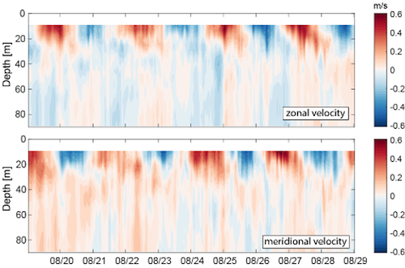
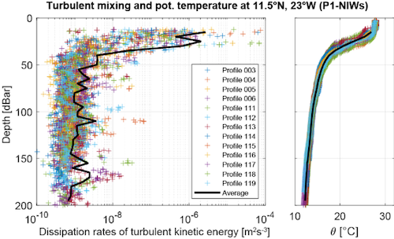
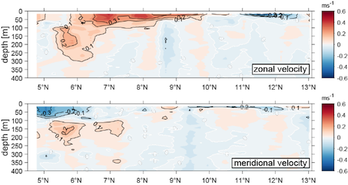
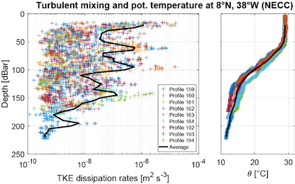

{logo}`BOWTIE`

# {front}`report_id`

## Summary

Today RV Meteor retrieved our gliders and drift buoys (including one with the Wire-Walker) after deploying them three days ago (their third and final deployment of the cruise). We are now on the final leg of our cruise and are racing west/northwest to try to make it to the center of HALO's "c2" circle for their flight tomorrow.  

We also had our usual daily briefing and science discussion at 10:20 LT, with a presentation by Charlotte Mertz about the physical oceanography measurements taken during the cruise. The four primary instruments for physical oceanography measurements are the MSS (micro-structure sonde), CTD (conductivity, temperature, depth), gliders (with MSS probe), drift buoys, and shipborne acoustic doppler current profile (ADCP). The gliders and drift buoys have been deployed three times, MSS and CTD stations are conducted approximately every 6 hours, and the ADCP measures continuously. Other shipborne instruments, such as the thermosalinograph (TSG) and sea snake also contribute continuous measurements of salinity and sea surface temperature near or at the ocean's surface. 

As discussed on the 15.09 daily report, our first two physical oceanography process studies in the eastern and central Atlantic revealed very different conditions. In the eastern Atlantic, there were prominent near-inertial waves. The first figure below shows the currents measured by the drifting buoy during its deployment. The alternating patterns in the velocity fields are indicative of the near-inertial waves, with the 2.5 day period matching the expected inertial period at 11.5N. We were quite lucky in that this time period had elevated near-inertial wave activity. Observations from the Pirata buoy at 11.5N, 23 W from NOAA/AOML, which has a longer-term record, indicate that the velocity fluctuations were unusually high during our study period. The strongly enhanced turbulent mixing in the upper 25 m driven by the near-inertial waves is visible in our MSS data while near this location (second figure below).

On the other hand, our second study location in the eastern Atlantic did not exhibit near-inertial waves but we did sample the North Equatorial Countercurrent (NECC) and the North Equatorial Undercurrent (NEUC). Both are eastward currents, but the NECC was present from the surface to about 50 m, between 6N and 10N, whereas the NEUC is deeper, between 100-250 m depth, around 5.5-6N (see first figure below, from the ADCP on Meteor). Both the gliders and the ship-based MSS indicate strongly elevated mixing throughout the upper 150 m of the water column (see second figure below, from the MSS data). This is stronger mixing than is expected even in the Equatorial Undercurrent, but unlike the mixing associated with near-inertial waves, it is disconnected from the ocean's mixed layer due to the strong salinity stratification. 

Finally, Charlotte shared the results of the oxygen titration contest (see briefing from 05.09). Outside of the physical oceanography team, who collects the water samples regularly, the best water samples for oxygen titration were collected by (drumroll, please)...in third place, Hans Segura; in second place, Lennea Hayo; and in first place, me! All figures are from Charlotte's presentation, with contributions from the oceanography team (Charlotte Mertz, Marcus Dengler, Christian Begler, Philipp Henning, Daniel Blandfort, Celine Imker, Joelle Habib).

## Remarks
- Meteor is in the UTC-3 time zone.
- Radiosondes were launched on the normal 3-hourly schedule.
- STRINQS has ceased drone operations. 
- The gas exchange measurements are no longer running.
- The WindCube lidar stabilization is not working, but the lidar is still running. 
- We plan to meet HALO on 19.09, 21.09, and 23.09.
- The SEA-POL radar was down from 06:00 UTC (03:00 LT) - 19:30 UTC (16:30 LT), due to a burnt out low voltage power supply in the transmitter. The part was replaced and the radar returned to operation.

## Plans
- 19.09: Head northwest towards Barbados, meet HALO near the center of their c2 circle.
- 19.09 - 21.09: Head northwest toward Barbados, meet HALO near 11.7N, 56W on 21.09.
- 21.09 - 23.09: Head northwest towards Barbados.
- 23.09: Station off of Barbados Cloud Observatory, coordinate with HALO. Conclude measurements at 16:00 LT.
- 24.09 07:00 LT: Arrive in port at Bridgetown, Barbados

## Events

Time (Local) | Comment
------------- | -----
07:17 - 07:56 | Retreive drift buoy
08:29 - 08:37 | Retreive glider
10:20         | Meeting led by D. Klocke, presentation by C. Mertz
12:02 - 12:18 | Retrieve glider
13:04 - 13:33 | Retrieve drift buoy with Wire-Walker

