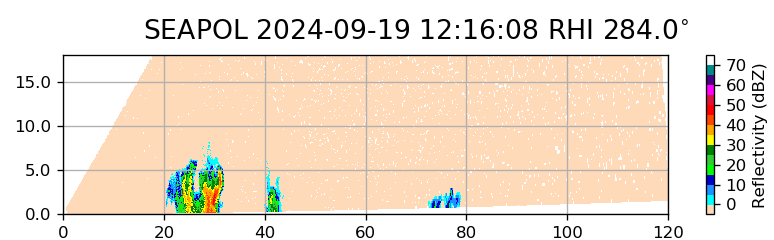
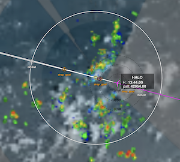
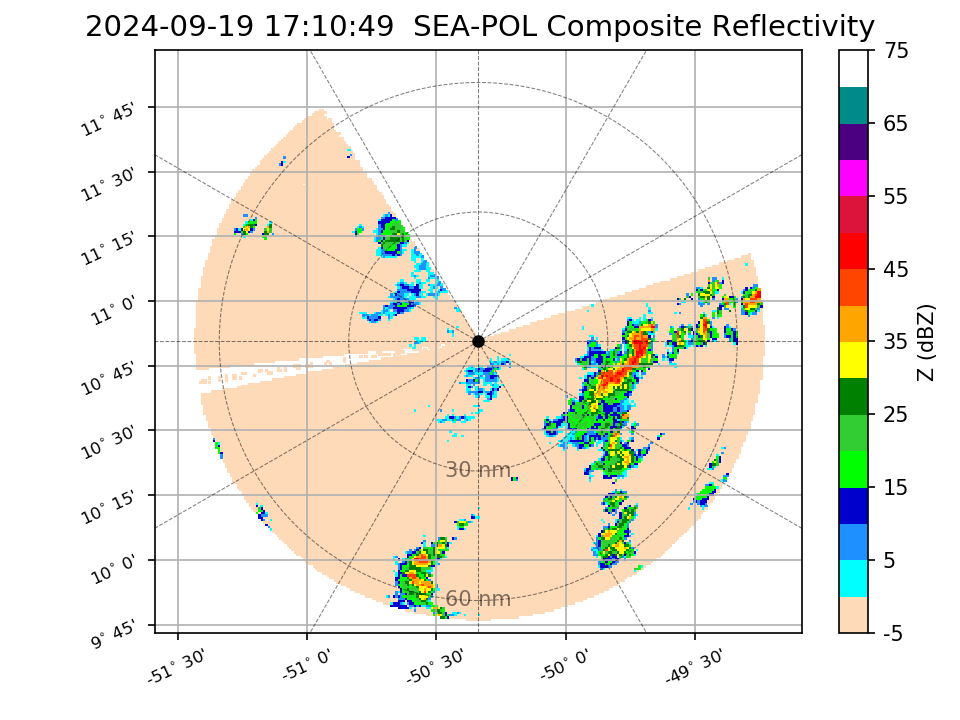
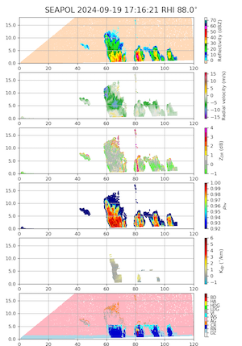
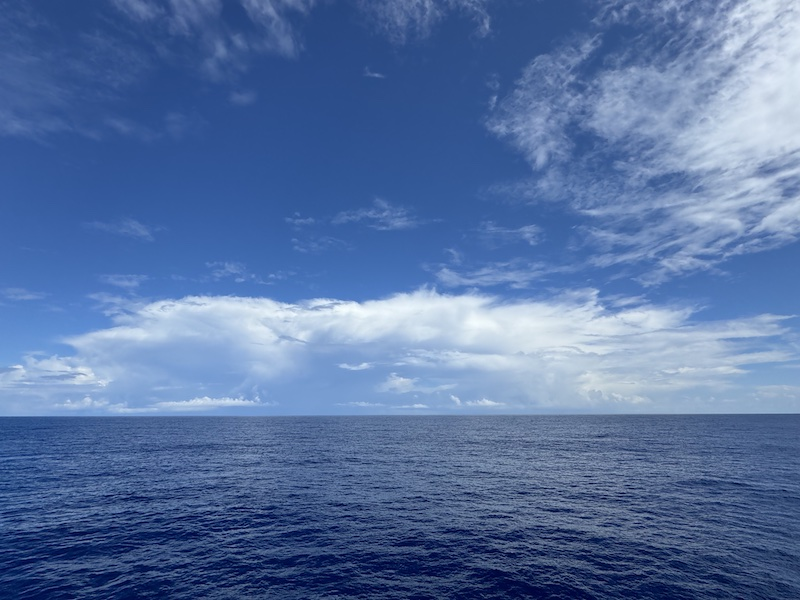
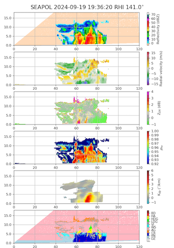
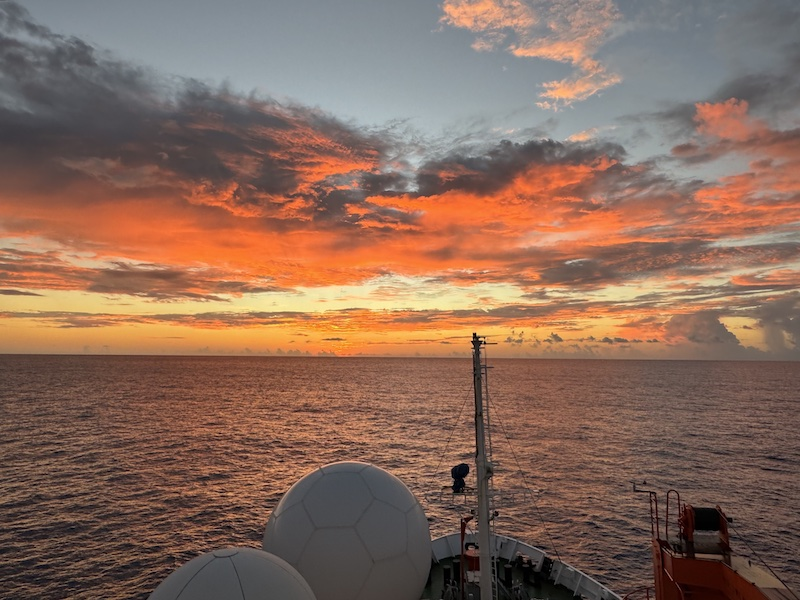

{logo}`BOWTIE`

# {front}`report_id`

## Summary

From yesterday afternoon to this morning, RV Meteor raced west to meet HALO. For us, "racing" means traveling at 10 knots and not stopping for oceanographic stations. At the time of HALO's first overpass on their way to the easternmost portion of their track (9:20 LT/12:20 UTC), we were a little more than 10 nmi away from the center of c2, HALO's second circle. Normally we stop during an overpass and position ourselves for optimal SEA-POL radar scanning along the flight path, but today we steamed on, to not lose time on our way to the circle center. By the time HALO came for their second overpass at 10:47 LT/13:47 UTC, we were just a few miles shy of the center. On this second overpass, HALO managed to drop a sonde only 0.5 nmi from our location - their closest yet! During HALO's circle around us, Meteor did our own small circle to fill SEA-POL's blanking sector, and then ended parked at the circle center. While HALO was in our vicinity, we experienced mostly sunny skies with low winds (0.5 m/s at one point!) but there was widely scattered convection all around us. Most of this was relatively shallow congestus-type convection, with echo tops around 5 km, with an occasional cell reaching 8-10 km. The first figure below shows an RHI scan depicting a representative example of this convection along HALO's flight path a few minutes before their first overpass. The second figure below shows SEA-POL imagery overlaid on visible satellite imagery a few minutes before HALO flew over Meteor the second time. This was actually more convection than we expected in this region, given the model forecast and satellite presentation. 

Later in the afternoon, after HALO had moved on to other parts of their flight, the scattered convection diminished and larger, deeper, and more organized cells developed. Right after HALO left us, a cell moved in from the southeast and we conducted an MSS and CTD in the rain. While facing southwest for the CTD, we had a great view of a convective line that had reflectivity of 60 dBz and very heavy rain with big rain drops (see first two figures and photo below). After the CTD finished and we turned to head west, the storm was in our blanked sector for a while. A few hours later, it re-emerged just outside of our blanked sector, with widespread high reflectivity values reaching to truly impressive heights (see third figure below). The PICCOLO team was actually having a science meeting in the radar lab during this time, and interrupted our discussions about planned model simulations and case studies to ooh and ahh over the RHIs. We quickly decided that today might be a good day to simulate - a day that wasn't remarkable in terms of the large-scale environment and coverage of rain, yet still managed to generate organized cells that were deep and intense. We have had many days such as these, days in which we thought our chances for precipitation were nil, yet the atmosphere still managed to generate something somewhere nearby. 

We also had our usual daily BOWTIE briefing and science discussion at 10:20 LT, with a presentation by Celine Imker. Celine discussed how measurements from the Wire-Walker will provide insights into the influence of biology on the carbon cycle. She also discussed the sargassum algae that we have encountered on our cruise. I'll share more about Celine's research tomorrow; for now I leave you with a photo of what is probably the most stunning sunset we've had to date -- at least judging by the number of (mostly atmospheric) scientists who stood on the peildeck watching it! By the time this cruise is over, our cameras will be filled with hundreds of photos of clouds.

## Remarks
- Meteor is currently in the UTC-3 time zone. Tomorrow (Friday) night we will switch from UTC-3 to UTC-4.
- Radiosondes were launched on the normal 3-hourly schedule, with an extra sonde at 9:20 LT/12:20 UTC for HALO.
- STRINQS has ceased drone operations. 
- The gas exchange measurements are no longer running.
- The WindCube lidar stabilization is not working, but the lidar is still running. 
- We plan to meet HALO on 21.09 and 23.09.

## Plans
- 20.09 - 21.09: Head northwest toward Barbados, meet HALO near 11.7N, 56W on 21.09.
- 21.09 - 23.09: Head northwest towards Barbados.
- 23.09: Station off of Barbados Cloud Observatory, coordinate with HALO. Conclude measurements at 16:00 LT.
- 24.09 07:00 LT: Arrive in port at Bridgetown, Barbados

## Events

Time (Local) | Comment
------------- | -----
09:20 | HALO overpass
10:20 | Meeting led by D. Klocke, H. Segura with presentation by C. Imker
10:47 | HALO overpass
11:30 - 11:50 | SEA-POL circle at center of HALO's circle (10:55 - 11:55)
12:17 - 12:53 | MSS
12:59 - 14:48 | Plankton CTD