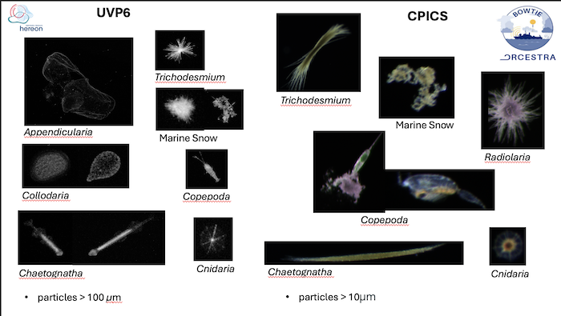
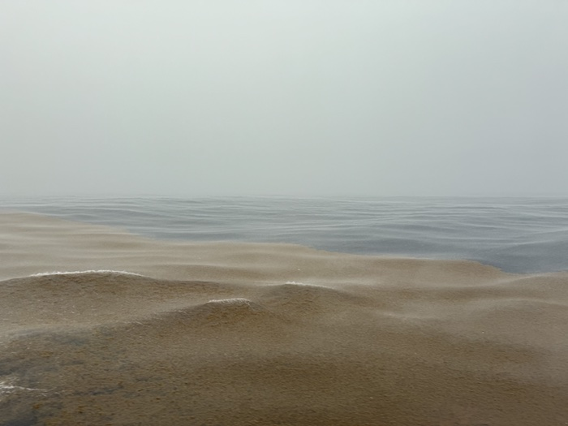

{logo}`BOWTIE`

# {front}`report_id`

## Summary

RV Meteor continues to steam west towards Barbados. Sunny skies with scattered small cumulus clouds, and next to nothing on the SEA-POL radar scope, dominated the day. Now that we are in the western Atlantic, we are displaced from the primary convective activity in the ITCZ, so the chancese for widespread precipitation are low. Pop-up showers are our best chance for rain. As we saw yesterday, meaningful rain can emerge out of seemingly nothing, but it remains to be seen whether that occurs again this evening (hopefully not, given our planned end of cruise social gathering) or tomorrow during our planned coordination with HALO (hopefully it does then).

In yesterday's science discussion Celine Imker presented about the biological carbon pump. Her research focuses on characterizing zooplankton, motivated by their role as a source of food for higher trophic levels (up the food chain) and a source of energy in the microbial loop. Celine uses photos taken by the cameras mounted on the Wire-Walker to study the different types of zooplankton and other microorganisms at different vertical levels. The UVP6 (underwater vision profiler) camera detects organisms with sizes larger than 100 µm, while the CPICS (Continuous Particle Imaging Classification System), which is essentially an underwater microscope, can detect organisms with sizes larger than 10 µm. The CPICS camera also allows one to take photos in color, giving an additional source of data to analyze the organic components that zooplankton feeds from. The figure below shows a comparison of photos taken by the UVP6 and CPICS cameras on the Wire-Walker. Most of the photos are of individual organisms, whereas marine snow includes organic material such as dead phytoplankton, zooplankton remains, and fecal pellets. It may also include inorganic material such as mineral particles from sediment and the remains of organisms with mineralized skeletons (such as silica or calcium carbonate).

In the second part of her presentation, Celine talked about the type of algae that Meteor has encountered along its trip: the sargassum. Before 2011, sargassum was only found in the Sargassum Sea located in the subtropical North Atlantic. Since then, Sargassum has spread along the equatorial Atlantic. Sargassum is an invasive species that blocks sunlight (minimizing photosynthesis) and disrupts ship traffic, fishing, tourism, and the economies of coastal communities. However it also provides a habitat for invertebrates, juvenile fish, sea turtles, and birds. There is still debate regarding the mechanism by which sargassum was introduced to tropical water, but one explanation for the transport of sargassum from the subtropics to the tropics is the changes in the atmosheric wind patterns around 25°N-30°N in the winter of 2009-2010 associated with a strong negative North Atlantic Oscillation (a mode of variability in the atmosphere). The below photo shows an example of a particularly thick mat of sargassum seen on our cruise.

In today's meeting, Mateo Lovato provide an overview of the technical specifications of the SEA-POL radar. One of the notable facts he shared was that the power consumption of the HVAC system that cools the radar shelter is just under twice that of the radar itself! The total weight of the radar shelter, platform, positioner, antenna, and radome is 9950 kg (21,750 lbs.), though the radar shelter and platform with/radome are lifted on and off the ship seperately. Mateo described all the parts of the transmitter and receiver and highlighted which components broke (and were fixed!) on this cruise: the low noise amplifier in the receiver, a leaking hose in the waveguide dehydrator, the power cable to the radar container, and the low voltage power supply in the modulator within the transmitter. When deploying in the field, the SEA-POL engineers have to be prepared for anything - we carry spares for some of the parts, but for other things, creativity and ingenuity are required to fix it. In this we also have benefitted from the excellent support from Meteor's electrician. 

## Remarks
- Meteor is currently in the UTC-3 time zone. Tonight we will switch from UTC-3 to UTC-4.
- Radiosondes were launched on the normal 3-hourly schedule.
- STRINQS has ceased drone operations. 
- The gas exchange measurements are no longer running.
- The WindCube lidar stabilization is not working, but the lidar is still running. 
- We plan to meet HALO on 21.09 and 23.09.

## Plans
- 21.09: Meet HALO near 11.7N, 56W.
- 21.09 - 23.09: Head northwest towards Barbados.
- 23.09: Station off of Barbados Cloud Observatory, coordinate with HALO. Conclude measurements at 16:00 LT.
- 24.09 07:00 LT: Arrive in port at Bridgetown, Barbados

## Events

Time (Local) | Comment
------------- | -----
01:03 - 01:55 | MSS
02:07 - 03:24 | CTD with water for incubation
09:00 - 09:27 | MSS
09:35 - 10:33 | Plankton CTD
10:20 | Meeting led by D. Klocke, presentation by M. Lovato
19:30 | End of cruise social

