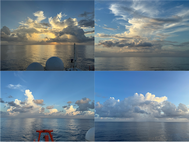
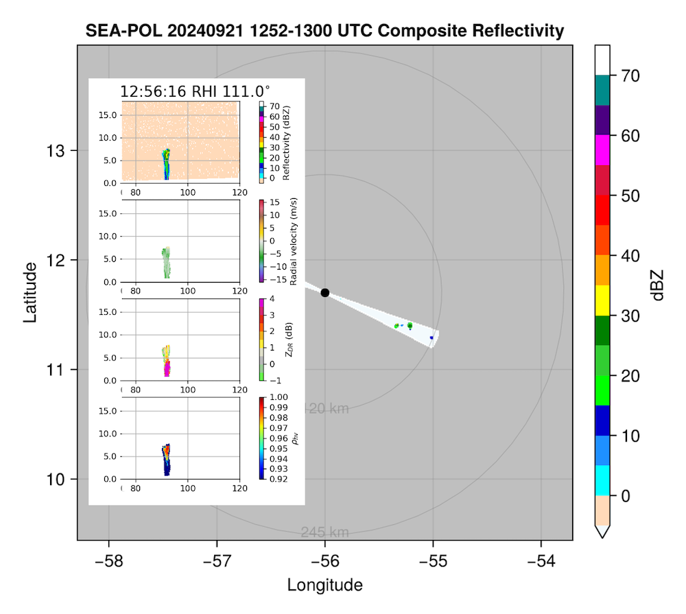
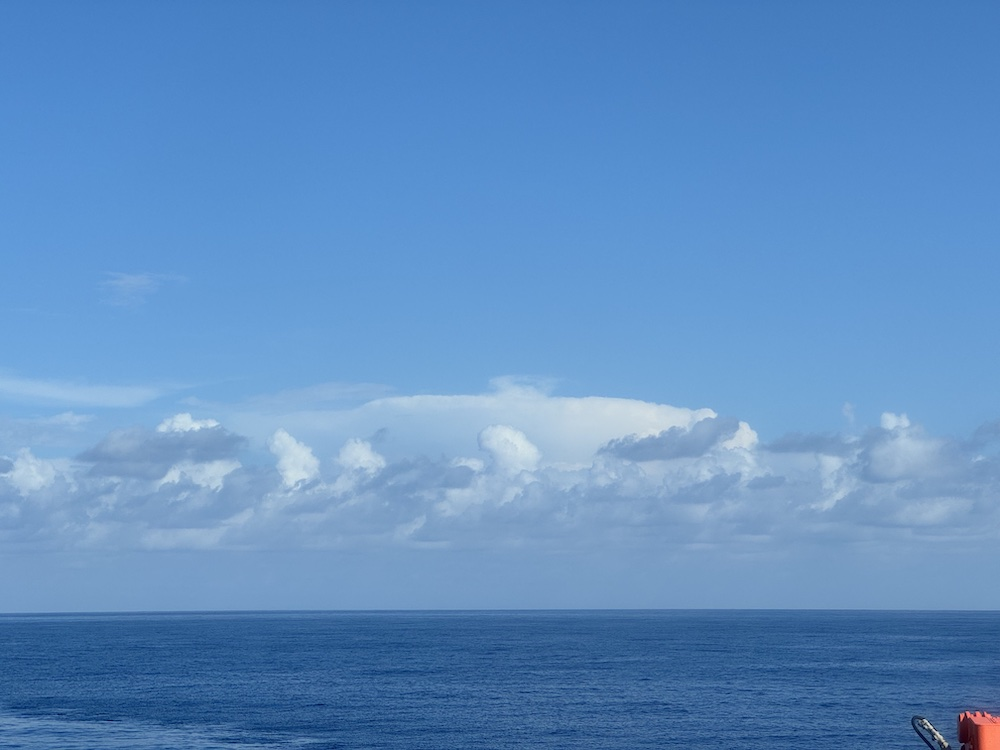
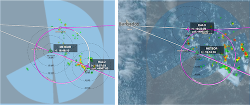

{logo}`BOWTIE`

# {front}`report_id`

## Summary

RV Meteor continues to steam west towards Barbados. I could almost write the exact same sentence as the last few days to describe the weather. There were sunny skies with widely scattered small convective cells. It was very hot (peak air temperature of 30.4C, maximum SST of 31.6C) with little breeze (winds were mostly between 1-3 m/s with a minimum of 0.3 m/s). My unofficial recollection is that these were the hottest conditions we've experienced on the cruise. The morning was very clear; in the afternoon, more widespread "popcorn"-type convection with a few larger, deeper cells developed far to our East; in the evening a few deeper precipitating (but still spatially isolated) cells developed around us. They were not especially impressive looking on radar but they were very visually appealling (see photo below, showing the view on each side of the ship just before sunset).

This morning, we met HALO for their westernmost circle soon after their takeoff from Barbados. It was an early start for those coordinating between HALO and SEA-POL (i.e., me), but at least our switch to the UTC-4 time zone meant that the start of HALO's circle at 11:49 UTC/07:49 LT "felt" like 08:49 LT. After their circle (during which Meteor was circling about HALO's circle center), HALO flew over the Meteor, with the overpass at 12:57 UTC/09:57 LT. Our RHI scans along their flight path picked up a very narrow convective cell with echo tops between 6-8 km (see first figure below, which shows the sector we scanned for the overpass and one of the RHI scans in the inset).

Later in the day, HALO returned for a second circle around us starting at 18:25 UTC/14:25 LT. We had been steaming west and the radar view was not inspiring. But lo and behold, once we starting our circe maneuver, we discovered all the convection had been hiding behind us! HALO reported seeing clusters of deep clouds interspersed with shallow clouds and clear sky within the circle. We also had a nice view of a deeper, somewhat larger convective system (see photo below). Way out towards the end of our long-range, we were scannning it with the 0.5 degree elevation angle at a height of about 3.5-4 km. But HALO flew right over it and reported that it was the most reflective cloud top they had seen that day, with radar returns 12 km deep. They also saw deeper overshooting tops in the vicinity (estimated to be 15-16 km deep). Again, the atmosphere managed to surprise us with a variety of interesting convective structures - the figure below shows HALO's track overlayed with the SEA-POL radar imagery (and on the right, also visible satellite imagery) during their second circle. 

We also had our usual daily briefing at 10:20 LT.

## Remarks
- Meteor changed time zones last night is currently in the UTC-4 time zone, same as Barbados.
- Radiosondes were launched on the normal 3-hourly schedule, with extra radiosondes launched at 11:50 and 17:20 UTC for HALO.
- STRINQS has ceased drone operations. 
- The gas exchange measurements are no longer running.
- The WindCube lidar stabilization is not working, but the lidar is still running. 
- We plan to meet HALO on 23.09.

## Plans
- 22.09: Head northwest towards Barbados. Arrive off the coast by Barbados Cloud Observatory in the evening.
- 23.09: Station off of Barbados Cloud Observatory, coordinate with HALO. Conclude measurements at 16:00 LT.
- 24.09 07:00 LT: Arrive in port at Bridgetown, Barbados

## Events

Time (Local) | Comment
------------- | -----
07:45 - 08:20 | SEA-POL circles (HALO circle 07:49 - 08:47)
08:57 | HALO overpass
10:20 | Meeting led by D. Klocke
09:07 - 09:36 | MSS
09:44 - 11:01 | CTD
14:25 - 15:25 | SEA-POL circles during HALO circle 
15:30 - 15:40 | SEA-POL steaming towards convection
21:04 - 21:30 | MSS
21:39 - 23:12| Plankton CTD

