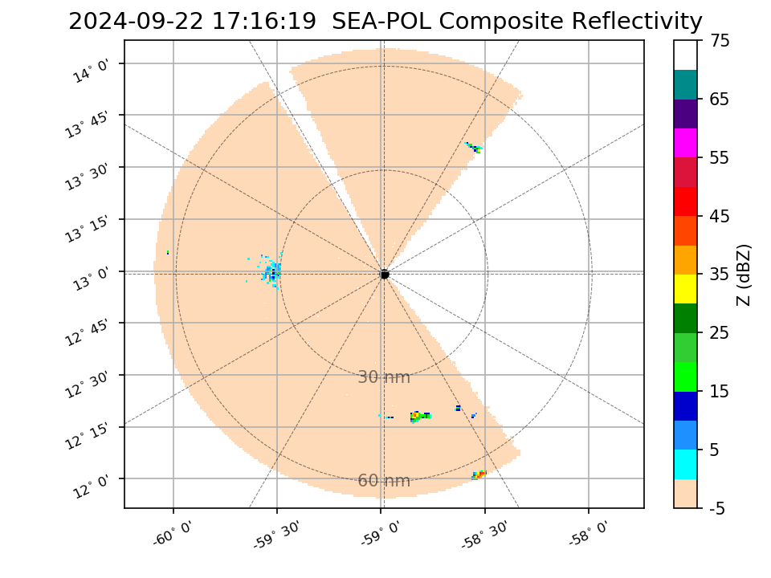
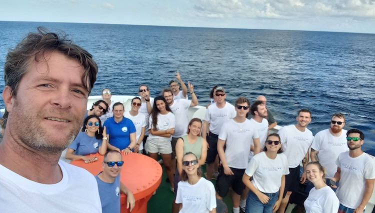
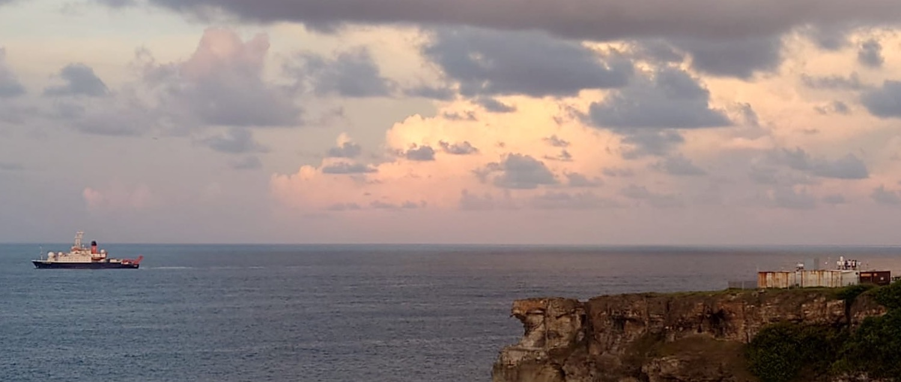
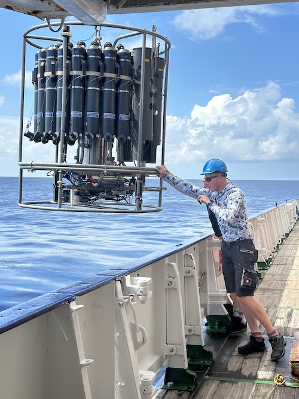
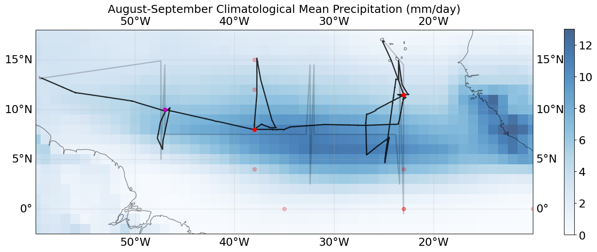

{logo}`BOWTIE`

# {front}`report_id`

## Summary

Hello Barbados!

Last night was our last night in the open ocean, as this afternoon at 13:15 LT, RV Meteor sighted land for the first time since our visit to Praia on 28.08. As we approached Barbados, we saw its ridgeline emerge on the horizon when we were about 30 nmi away. The SEA-POL radar picked up the island as well (see light blue echos due West in the figure below). The radar return from Barbados itself was larger than any other echos around this afternoon, with the weather again hot and sunny with light winds and scattered small cumulus clouds.

Just after 16:00 LT, we arrived at our position just offshore of Barbados, and took our group photo on the bow of the Meteor. A preview is shown below, courtesy of Daniel Klocke. We are currently stationed 0.7 nmi East of the Barbados Cloud Observatory (BCO) at Deebles Point, where we will spend the next day making measurements alongside the extensive suite of instrumentation at the BCO, in coordination with [SCORE](../score.md). Shortly before we arrived, our colleauges at the BCO were able to see our radiosonde launch at 15:50 LT, and both Meteor and the BCO will continue to launch sondes through tomorrow. Tomorrow morning (23.09), HALO will perform a circle just East of Barbados shortly after their takeoff from BGI, overpassing Meteor three times at the western edge of their circle. This is a unique opportunity for coincident measurements from ground-based, ship-based, and airborne platforms. The second photo below shows the BCO and Meteor together, just after sunset this evening (courtesy Tristan Vostry).

We will then shut down our instruments in the afternoon so that we can prepare to uninstall them from the Meteor and disembark the next day. Our planned arrival in port at Bridgetown, Barbados is 07:00 LT, 24.09. Our oceanographic measurements ended this morning, with our last MSS at 09:00 LT and our last CTD ending just before 11:00 LT, when the depth to the sea floor dropped to less than 2000 m (see photo below, courtesy Philipp Henning).

Now that we have arrived at our final scientific waypoint, we can consider how our actual ship track compared to what we had planned. Years ago, when the BOWTIE proposal was first submitted, its name was motivated by the planned ship track, which drew a bowtie pattern across the Atlantic. During the Ringberg planning meeting in March 2023, this evolved to the idea of doing three sets of ITCZ transects, which is shown in gray on the plot below. With the launch of EarthCare, the plan evolved further to include detours from purely north/south transects in order to catch more EarthCare (and HALO) overpasses. Our plan had to evolve further in real-time during the campaign, based on how far we needed to travel north and south to catch the edge of the ITCZ, and the adjustments we had to make due to our late departure. In the end, while our actual track (black line on the plot below) is a bit messier than any plan, we successfully sampled the ITCZ from north to south, east to west, with three transects, three deployments of gliders and drift buoys, six EarthCare overpasses, and, to-date, nine days with coordinated sampling with HALO. Our tenth HALO coordination will occur tomorrow. The color shading on the plot shows the climatological August-September precipitation (from GPCP). Our perception is that the precipitation was further north than climatology during our campaign, which will be confirmed with post-campaign data analysis.

## Remarks
- Meteor is in the UTC-4 time zone, same as Barbados.
- Radiosondes were launched on the normal 3-hourly schedule.
- STRINQS has ceased drone operations. 
- The gas exchange measurements are no longer running.
- The WindCube lidar stabilization is not working, but the lidar is still running. 
- We plan to meet HALO on 23.09.
- Oceanographic stations have ended.
- The SEA-POL radar was down from 1950 - 2035 UTC, to facilitate our group photo.

## Plans
- 23.09: Station off of Barbados Cloud Observatory, coordinate with HALO. Conclude measurements at 16:00 LT.
- 24.09 07:00 LT: Arrive in port at Bridgetown, Barbados

## Events

Time (Local) | Comment
------------- | -----
09:03 - 09:37 | MSS
09:46 - 10:57 | CTD
15:00 - 15:20 | SEA-POL circle
16:00 | Group Photo 

