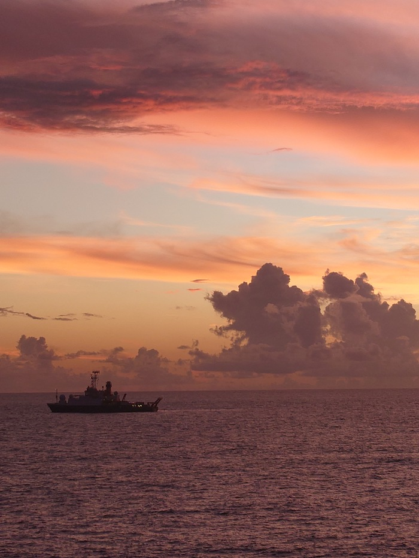
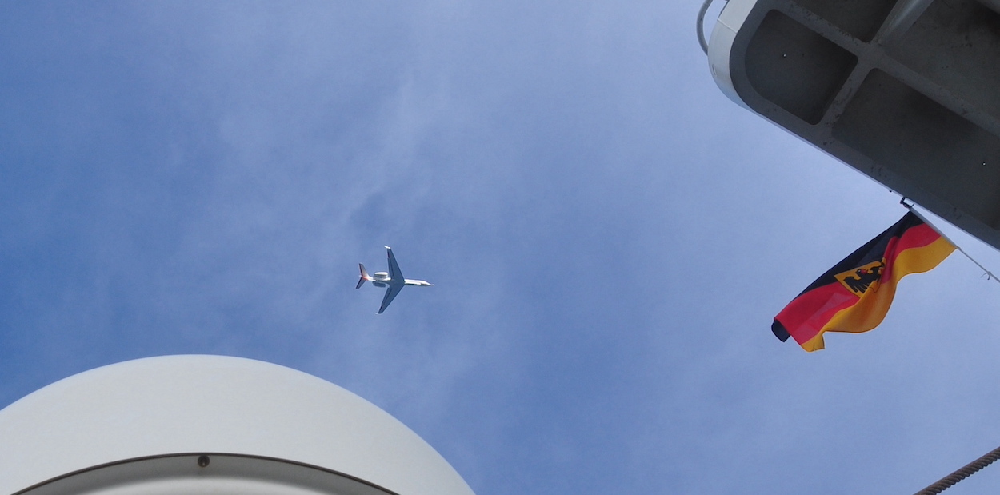
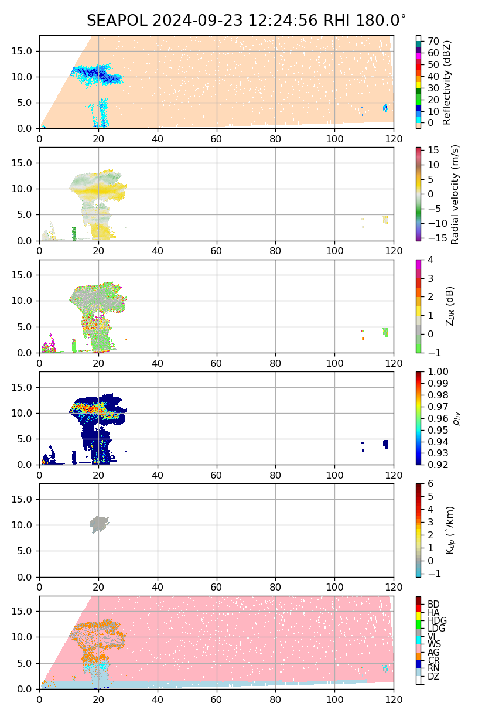
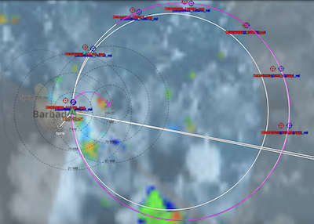
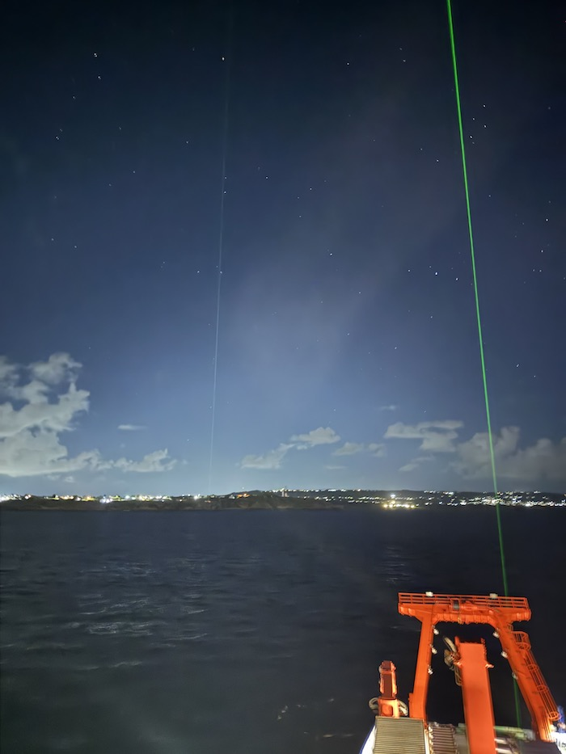
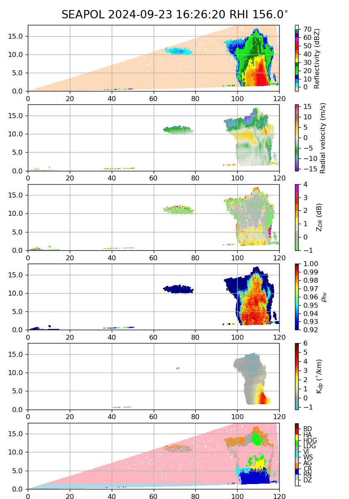
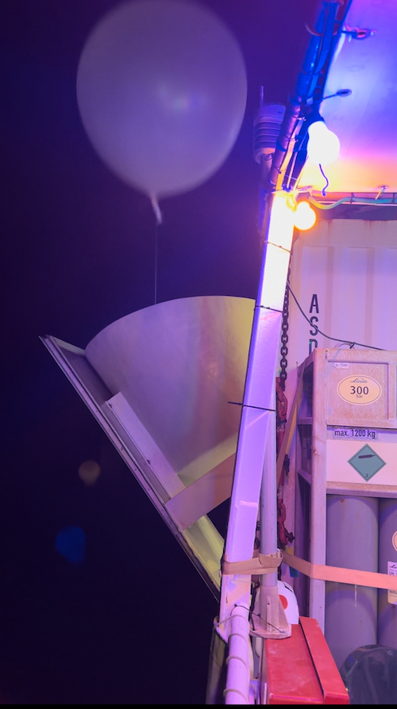

{logo}`BOWTIE`

# {front}`report_id`

## Summary

Today was RV Meteor's last day of measurements. We began the day with a stunning sunrise (see photo below shared by Yuting Wu) followed by our tenth and final coordination with HALO, while stationed next to the BCO. 

HALO flew over the METEOR shortly after take-off at an altitude of 1 km and we had a great view of the plane (see photo below). After climbing, they then flew over us twice more as we were stationed at the western edge of their first circle, which was a smaller than standard circle with radius 39 nmi. Just before they passed over us at the start of their circle, we experienced light rain over the Meteor. SEA-POL conducted scans along their flight path, and measured a precipitating anvil at 13 km on the RHI scan to our south as HALO approached at the end of their circle (see figure below), which was consistent with what scientists on board HALO saw out of their window. HALO flew over us for a fourth and final time in the late afternoon just before landing at BGI.  

This coordination between HALO, RV Meteor, and the BCO represents an incredible collection of instruments across three platforms assembled in the same time and place. HALO's circle provides measurements of the upstream environment, SEA-POL provides the spatial structure of convection, and similar vertically pointing instruments at BCO and on the RV Meteor provide an oppportunity for comparison over a small spatial scale. Both Meteor and BCO were launching radiosondes throughout the day, and HALO released dropsondes in a 39 nm-radius circle just East of the BCO and Meteor. At night, observers on both land and sea could see the lidars on the Meteor and at the BCO both beaming into the sky at night (see photo below). The longer record of observations at the BCO will also help contextualize the measurements taken by HALO and the Meteor. 

By the afternoon, it was time to turn off the rest of our instruments so they could be prepared for removal from the Meteor and packed for shipping back to their respective homes, or, to their next field campaign deployment. SEA-POL performed its last scan at 12:29:30 LT. We had planned to shut it down by 13:00 LT, but then moved up the deadline to 12:20 LT, since more time was needed to prepare it for de-installation and the radar scope was pretty quiet. We did one last set of RHIs on the only substantive echo in our near-range, and the scan was so impressive that we couldn't stop ourselves from performing one more 10-minute cycle. One of the angles from the last set of RHIs is shown in the figure below, with echo tops about 15 km, a graupel signature, and heavy rain rates indicated by Kdp. For a campaign focused on deep convection that found itself measuring congestus much of the time, it is fitting in a way that the atmosphere put on a show for our last scan. 

We also held our final daily briefing at 10:20 LT. As the sun now sets on the BOWTIE cruise, we will enjoy our last night at sea on the RV Meteor before arriving in port tomorrow morning. Our official last measurement was the 0300 UTC 24 September radiosonde launched at 21:50 LT 23 September by the entire radiosonde team and its support staff, to the tunes of Ballone Estacion (see photo below). With this, BOWTIE's measurements have ended. 

## Remarks
- Meteor is in the UTC-4 time zone, same as Barbados.
- Radiosondes were launched on the normal 3-hourly schedule through 21:50 LT (01:50 UTC 24 Sept), with an extra ones at 5:50, 7:42 and 8:10 LT (the latter two lost contact above 600 hPa).
- STRINQS has ceased operations
- Oceanographic measurements ended yesterday.
- SEA-POL scanned its last scan at 12:29:30 LT (16:29:30 UTC), ending PICCOLO's data collection.
- Other instruments stopped collecting data around 16:00 LT after HALO flew over for the last time.

## Plans
- 24.09 07:00 LT: Arrive in port at Bridgetown, Barbados

## Events

Time (Local) | Comment
-------------| -----
07:17 | HALO overpass
07:55 | HALO overpass, coordinated SEA-POL scans
08:26 | HALO overpass, coordinated SEA-POL scans
10:20 | Meeting led by D. Klocke
15:52 | HALO overpass
21:50 | End of BOWTIE measurements (last radiosonde)

