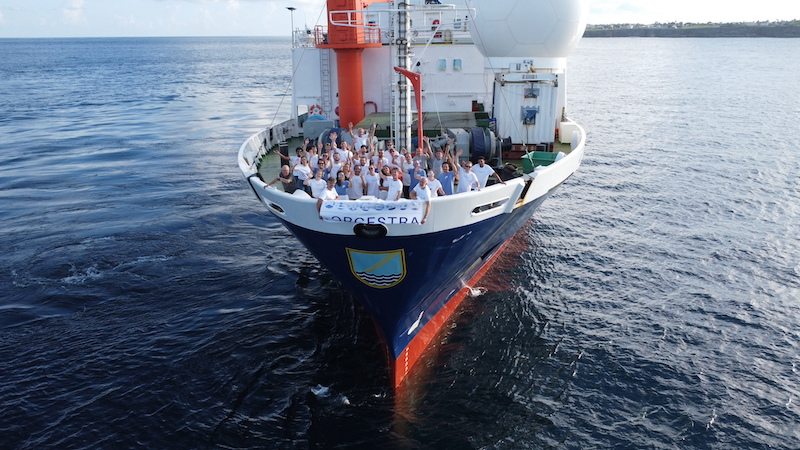

{logo}`BOWTIE`

# {front}`report_id`

## Summary

RV Meteor arrived at port in Bridgetown, Barbados this morning and the BOWTIE cruise has officially concluded.

As with any campaign, BOWTIE experienced ups and downs. It was a struggle in the beginning, with 5 delayed containers full of scientific instruments and ship provisions keeping us in Mindelo 6 extra days. For the first 12 days of the cruise, we were incomplete, as we left our STRINQS colleagues behind since the drones were still stuck in Lisbon, waiting for TAP Air Portugal to decide to put them on a flight to Mindelo. SEA-POL was only able to operate in single-polarization mode. But, we had the excitment of our first deployment of oceanographic instruments, first HALO and EarthCare overpasses, and plenty of interesting clouds and convection. On 28 August, we became complete when STRINQS rejoined us, and SEA-POL returned to full strength thanks to a replacement low noise amplifier. As the drone pilots gained confidence and the drones flew higher and further, we had high hopes as we headed into the central Atlantic. In the central Atlantic, we had our first days of truly being immersed within deep convection all day, filling the SEA-POL scope with returns (much to the chagrin of the crew on deck, who had to work in the rain). We had another succesful deployment of gliders and drifters, and measured surprisingly strong turbulent mixing in a vigorous North Equatorial Counter Current. But all the rain took a toll. Several instruments suffered issues due to water, and STRINQS had to cease operations after two drones fell into the sea (one rescued) and a third caught on fire. Despite these setbacks, we continued on, engineering creative solutions to problems, and learning from our experiences. Throughout it all, we collected extensive data from the bottom of the ocean to the top of the atmosphere. We measured everything from ocean temperature, salinity, currents, turbulence and plankton to atmospheric temperature, winds, humidity, clouds, and rain. We collected measurements in hot, sunny, low wind conditions with calm water, and in torrential rain with gusty winds and rocky seas. We saw small puffy clouds, deep cumulonimbus clouds, squall lines, gust fronts, stratiform rain...and more precipitating congestus than we ever could have imagined. 

We had long days, hard work, hot and humid weather, often little sleep, and more potatoes and cabbage then I ever thought I would consume. But I think I speak for us all when I say it was an unforgettable experience, full of truly surreal moments - sunrises, sunsets, rainbows, whales, birds (Bowie & Pico), eating fresh caught grilled tuna, taking 1000 cloud photos, sipping drinks together in the middle of the ocean under an awning lit by Christmas lights, and dancing together under the moonlight. We benefited from incredible support by the fantastic RV Meteor crew, had an amazing science team, and collected exciting data. While the field phase of BOWTIE, PICCOLO, and STRINQS have ended, the science is only beginning. 

Signing off for BOWTIE, and best wishes to the RV Meteor as it continues on its next journey.

## Remarks
- Meteor arrived in port at Bridgetown, Barbados at 07:00 LT.

## Events

Time (Local) | Comment
-------------| -----
07:00 | Arrival in Bridgetown

