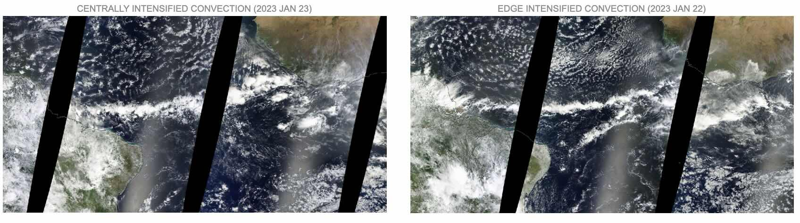

# Science

## The scientific motivation for PERCUSION

*Figure 1. William Ferrel's schematic depiction of Earth’s surface wind. Figure taken from Birner et al, 2014 and adapted from Ferrel, 1856.*

Most tropical rain is concentrated within a narrow latitudinal band known as the Inter-Tropical Convergence Zone (ITCZ). This band shifts in position, width and longitude on timescales from days to millenia, with consequences for the billions of people who live within its reach.

These variations in the ITCZ have been linked to changes in the atmosphere's energy balance, but this balance is itself hard to constrain --- it depends on mesoscale circulations which are notoriously difficult to measure (vertical winds are usually an order of magnitude smaller than horizontal winds). Without these observations, we are unable to constrain our theories and computer simulations, limiting our ability to predict future changes in the width and position of the ITCZ.

Will the islands of Cape Verde, which lie at the edge of the ITCZ, get wetter or dryer in the next 50 years? What about about the Sahel? We cannot yet confidently say what will happen.

To break this deadlock, one of PERCUSION's scientific objectives is to measure the mesoscale vertical velocity $w$ at the center and edges of the ITCZ. Variability in $w$ will be characterized over 20+ flights between August and October in the East and West Atlantic. This will allow, for the first time, a process-level observational estimate of the ITCZ's circulation and energy export. With this information, we will be able to peer into the inner life of the ITCZ and understand why it billows and blows.

```{admonition} Knowledge Check
:class: tip dropdown

Want to learn more? Then you are in the right place. Our goal here is to provide a minimal introduction to the science that motivates PERCUSION.
```
### Energetic constraints on the ITCZ
The ITCZ rainfall is fed by warm and moist surface trade winds. Their convergence leads to deep convective clouds that precipitate and detrain in the upper troposphere. This divergent air then sinks in the subtropics and returns to the ITCZ as a surface flow, completing the meridional Hadley circulation (Figure 1).

To better understand the location and width of the ITCZ, it is helpful to consider energetic constraints. 

For instance, the ITCZ receives more energy from the sun than it emits back out to space in the zonal- and annual-mean, so the ITCZ must be exporting energy in the vertically-integrated net. In particular, it is the vertically integrated moist static energy $\langle m \rangle = \langle c_p T + Lq + gz \rangle$, where $\langle \cdot \rangle$ denotes a vertical integral, that is being exported. (We study $m$ rather than other variables such as the dry static energy, because $m$ is approximately conserved during deep convection, making it ideal for studying its transport throughout the atmosphere.)

From this constraint, one can deduce the location of the ITCZ by looking at where the vertically integrated meridional energy transport of moist static energy ($\partial_y \langle v m \rangle$) changes direction (Kang et al, 2008; Schneider et al, 2014). Determining the change in width of the ITCZ requires additional considerations about the mass balance of the Hadley Cell (Byrne and Schneider, 2016), and it primarily depends on the Gross Moist Stability ($\mathcal{M}$) of the atmosphere, a measure of how efficient the export of moist static energy from the ITCZ is.

Thus, if one can understand where moist static energy is being exported ($\partial_y \langle v m \rangle$) and how efficiently this is done ($\mathcal{M}$), then one can obtain a basic understanding of where the ITCZ lies and how wide it should be. 

```{admonition} Caution
:class: warning dropdown

The trouble is, as will soon see, that these theories are hard to constrain theoretically and observationally, which limits our ability to predict future changes in rainfall. Relevant questions such as how the width of the ITCZ change as a function of longitude also remain unclear. This calls for the need to improve our observations of moist static energy export and its efficiency.

```


### The trouble with Gross Moist Stability
Look at the ITCZ in the zonal and annual mean and you will find a clearly defined band of precipitation and slow, convergent winds (Figure 2). 


*Figure 2. Annual-mean precipitation and surface winds. Precipitation maxima is marked by red lines. The right panel shows the zonal-mean precipitation data from the Tropical Rainfall Measuring Mission Multisatellite Precipitation Analysis for 1998–2012. The wind data are from the European Centre for Medium-Range Weather Forecasts interim reanalysis for the same years. Figure taken from Schneider et al, 2014.*

But, as has been known for decades, look at the ITCZ on daily timescales and you will find mesoscale patches of rain and sharp convergence lines; clear-skies and calm winds (Figure 3 and Frank, 1983).

*Figure 3. The morphology of the ITCZ changes from day-to-day, with distinct mesoscale variations. Snapshots from VIIRS (NOAA-20) from the 1st of July 2021 until the 15th of July 2021 in the East Atlantic (26°W to 20°W, 0° to 14°N). Credit: Julia Windmiller*

Sometimes you may find "centrally intensified" convection; other times you find "edge intensified" convection (Figure 4).

*Figure 4. The morphology of the ITCZ seems to have two modes: one with centrally-intensified convection (left); one with edge-intensified edge-intensified convection. Credit: Julia Windmiller*

This turns out to impact $\mathcal{M}$, the efficiency with which the ITCZ exports moist static energy (Masunaga, 2023). To see why, consider idealized thermodynamic profiles and meoscale circulations that are representative of the ITCZ.

*Figure 5. Typical mesoscale circulations within the ITCZ, suggested by sattelites and reanalysis (Masunaga, 2023). Credit Marty Singh.*

Mesoscale circulations can be decomposed into two modes: a "top heavy" deep circulation typical of a centrally-intensified ITCZ (Figure 5, left); and a "bottom heavy" shallow circulation typical of an edge-intensified ITCZ (Figure 5, middle). Given the profile of $w$ (Figure 5, right), one can use mass conservation to determine the primary outflow level of the height as where $-\partial_z w$ is maximized. For the top heavy circulation, this should peak in the upper troposphere; for the bottom heavy circulation, in the mid troposphere.

If one assumes horizontal gradients in moist static energy are small (as was done, for instance, in Neelin and Held, 1987), then one can show the Gross Moist Stability should be proportional to the vertically integrated product of moist static energy and horizontal divergence. That is,

$\mathcal{M} \sim - \int_{\text{z}_s}^{z_\text{TOA}}  dz \quad m \cdot \partial_z w$,

where $z_s$ is the surface and $z_\text{TOA}$ is the top of the atmosphere. (One can show this proportionality by starting with the definition of Gross Moist Stability from Equation 2.3 of Raymond et al, 2009, then assuming horizontal gradients in moist static energy to be zero, and then integrating by parts. The boundary term should be zero since $w$ is zero at the surface and the top of the atmosphere.) 

The benefit of this re-arrangement is that it makes clear the connection between Gross Moist Stability $\mathcal{M}$ and horizontal convergence/divergence ($\partial_z w$).


*Figure 6. Typical moist static energy profile of the tropical atmosphere (here denoted by $h$ rather than $m$) and the dependence of moist static energy export on the type of circulation. The vertical line represents the profile of a convecting air parcel. Figure taken from Julia Windmiller (see also Raymond et al, 2009).*

At the edges of the ITCZ, we generally expect an import of moist static energy at the surface due to the convergence of warm and moist trade winds. The export of this energy aloft, however, will depend on the type of mesoscale circulation present. 

For a typical c-shaped moist static energy profile of the environment (Figure 6), $\mathcal{M}$ will depend on the outflow level of the circulation. A shallow circulation will export a smaller amount of $m$ than a deep circulation will, since $m$ is less in the mid troposphere than the upper troposphere. Additionally, the nonlinearity of $m$ with height suggests that $\mathcal{M}$ computed with a zonal-mean profile of the ITCZ circulation may not be the same as computing $\mathcal{M}$ at the mesoscale and *then* taking the zonal mean.

The trouble with the energetic constraints on the ITCZ is that $\mathcal{M}$ depends on mesoscale circulations which are notoriously difficult to observe with satellite remote sensing (vertical winds are usually an order of magnitude smaller than horizontal winds). They are also difficult to infer theoretically since it is only the tropical-scale circulation that is energetically constrained (e.g. Held and Soden, 2006), rather than the mesoscale circulations within the ITCZ.

```{admonition} Knowledge Check
:class: tip dropdown

**To summarize:** we know that Gross Moist Stability $\mathcal{M}$ is a key quantity in predicting the ITCZ's changes, but we don't understand it well because it is hidden within the ITCZ's inner life, that is, its dynamic and thermodynamic mesoscale structure.
```

### The role of PERCUSION
To overcome this challenge, PERCUSION seeks to measure the mesoscale circulations within and at the edges of the ITCZ. The key hypothesis is that measuring these circulations and their occurrence frequency, along with calculating the energy export, will advance our understanding of the changes in width and location of the ITCZ and improve our predictions of future rainfall.

To do this, PERCUSSION follows the successful application of dropsonde circles during the EUREC4A campaign to infer mesoscale circulations (Bony, 2017). Dropsonde circles of about 130 km in radius will be placed at the center and the edges of the ITCZ on each of the 20+ flights planned for August - October 2024. The dropsondes measure the horizontal wind as a function of height (via a gps tracking the drift of the sonde), and then the mesocale vertical wind of the entire circle can be inferred from the divergence theorem.


*Figure 7. Potential causes for the low-wind speed events known as the "doldrums". Credit: Julia Windmiller.*

In addition to pursuing a better understanding of the ITCZ, PERCUSSION hopes to use these budgets of moist static energy and observed mesoscale circulations to test hypothesized controls on convective aggregation such as the up-gradient horizontal transfer of moist static energy (Muller, 2022); and to test hypothesized circulation controls on the doldrums such as the association between subsiding air and surface wind divergence (Figure 7 and Windmiller, 2024).

With PERCUSION, the ITCZ's inner life will be characterized to a degree not seen since the GATE field campaign took place exactly fifty years ago (Frank, 1983). GATE took place at the dawn of the era of General Circulation Models to help guide their development and use for understanding global climate change. Is it not fitting that PERCUSION will take place at the dawn of the era of Global Storm Resolving Models, guiding their development and helping us to understand regional climate change?

```{admonition} Remaining questions
:class: warning dropdown

* Should I go into more detail about the energetic constraints? (i.e. Kang et al, 2008; Schneider et al, 2014; Byrne and Schneider, 2016)
* Why does $m(z)$ have a c-shape? Is it really okay to assume that $m$ is constant in the horizontal?
* Should I include some example sonde profiles of $w(z)$? And should I provide a brief analysis of what they tell us? Or perhaps that should be its own page (at some point in the future)?
* Why is $m$ conserved?

```

### References
* **Birner et al, 2024** *The changing width of Earth’s tropical belt*
* **Bony et al, 2017** *EUREC4A: A Field Campaign to Elucidate the Couplings Between Clouds, Convection and Circulation*
* **Byrne and Schneider, 2016** *Narrowing of the ITCZ in a warming climate: Physical mechanisms*
* **Ferrel, 1856** *Essay on the winds and ocean currents*
* **Frank, 1983** *The Structure and Energetics of the East Atlantic Intertropical Convergence Zone*
* **Held and Soden, 2006** *Robust Responses of the Hydrological Cycle to Global Warming*
* **Kang et al, 2008** *The Response of the ITCZ to Extratropical Thermal Forcing: Idealized Slab-Ocean Experiments with a GCM*
* **Masunaga, 2023** *The Edge Intensification of Eastern Pacific ITCZ Convection*
* **Muller, 2022** *Spontaneous Aggregation of Convective Storms*
* **Neelin and Held, 1987** *Modeling Tropical Convergence Based on the Moist Static Energy Budget*
* **Raymond et al, 2009** *The Mechanics of Gross Moist Stability*
* **Schneider et al, 2014** *Migrations and dynamics of the intertropical convergence zone*
* **Windmiller, 2024** *The Calm and Variable Inner Life of the Atlantic Intertropical Convergence Zone: The Relationship Between the Doldrums and Surface Convergence*

